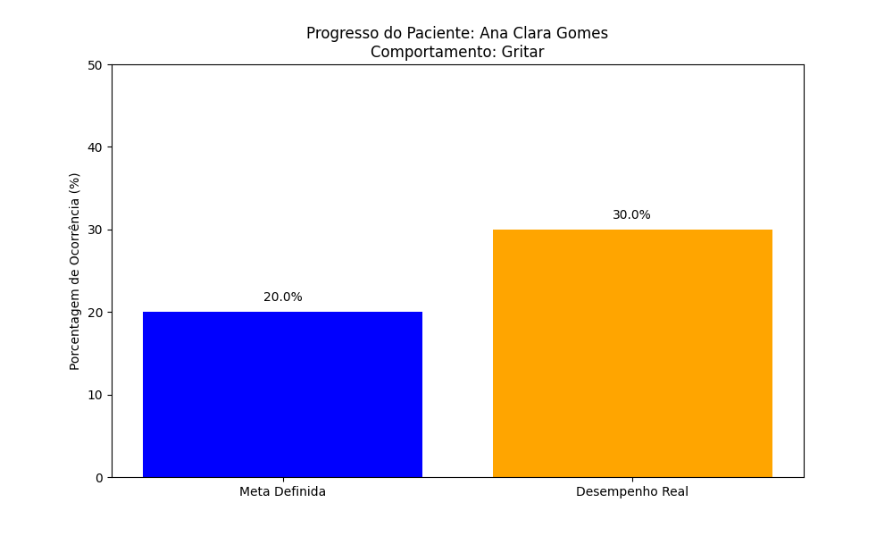

# Sistema de Inteligência de Dados para Clínica ABA

> Um projeto Full-Stack de Dados: Do Banco de Dados à Inteligência Artificial.

Este projeto simula a infraestrutura de dados de uma clínica de Análise do Comportamento Aplicada (ABA), integrando armazenamento seguro, análise automática de progresso e suporte diagnóstico via Machine Learning.

# O Desafio
Profissionais de ABA lidam com alto volume de dados (registros ABC, amostragem de tempo). O desafio foi sair das planilhas manuais para um sistema que permitisse:
1. Centralização segura dos dados dos clientes.
2. Visualização automática de metas terapêuticas.
3. Identificação de padrões comportamentais complexos usando IA.

# Tecnologias Utilizadas
* **Banco de Dados:** PostgreSQL (Hospedado no Supabase)
* **Linguagem:** Python 3.12
* **Bibliotecas de Análise:** Pandas, Matplotlib, Psycopg2
* **Machine Learning:** Scikit-learn (Decision Trees)

# Estrutura do Projeto
* `/sql`: Scripts SQL para criação do banco (Schemas V1-V5) e inserção de dados.
* `/scripts`:
    * `analise_progresso.py`: Conecta ao banco e gera gráficos de "Meta vs Real".
    * `ia_diagnostico.py`: Treina um modelo de IA com dados históricos para prever a função do comportamento.
* `/output`: Resultados visuais gerados pelos scripts.

# Destaques

# 1. Diagnóstico com IA 
O script `ia_diagnostico.py` utiliza uma Árvore de Decisão para aprender padrões de "Antecedente -> Comportamento -> Consequência".
* **Input:** "Terapeuta apresentou demanda" + "Paciente gritou"
* **Previsão da IA:** "Função: Reforço Negativo (Fuga)"

# 2. Relatórios Automatizados 
O script `analise_progresso.py` calcula automaticamente a porcentagem de ocorrência de comportamentos e compara com a meta clínica definida no banco de dados.

---
*Projeto desenvolvido como parte de um portfólio de transição de carreira para Tecnologia/Dados.*
